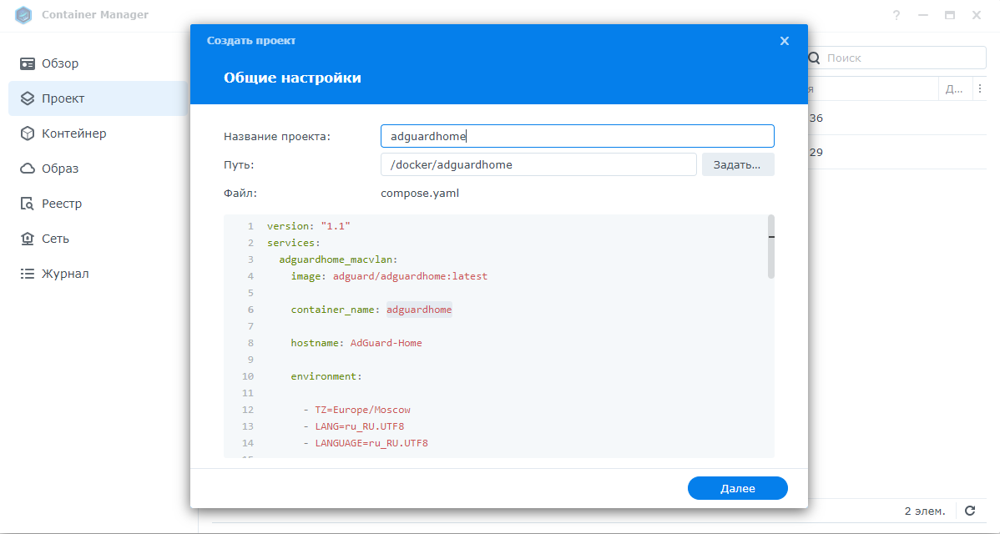

 # Adguard Synology Docker Compose
 

 
 

 Adguard Synology docker compose
 Подключиться по ssh к NAS и выполнить команды:
 # ifconfig 
 (для проверки eth0 или ovs_eth0) 
 # sudo docker network create -d macvlan -o parent=ovs_eth0 --subnet=192.168.1.0/24 --gateway=192.168.1.1 --ip-range=192.168.1.200/32 adguard_network 
 (выбрать свою подсеть, не повторяющийся ip  и родительский интерфейс ovs_eth0 или eth0)
 
 Создайте в File Station следующую структуру папок:

    /docker/adguardhome/work
  
    /docker/adguardhome/work/data 

    /docker/adguardhome/conf

 Открыть Container Manager, перейти на вкладку Проект, нажать создать проект. 
 
 

 
 

 
 Название проекта: adguardhome, указать путь установки /docker/adguardhome, создать Docker-compose.yml и вставить содержимое (или импортировать файл adguard-docker-compose.yml). 
 После установки в Container Manager перейти в Сеть и объеденить две сети Bridge и adguard_network (выбрать сеть - управление - поставить галочку)

 Перейти по адресу 192.168.1.200:3000 (или Ваш IP) для певоначальной настройки.
 
 

 
 

 
 Выберите в "Веб-интерфейс администрирования интерфейс" и "ДНС-сервер" - Сетевой интерфейс 192.168.1.200 (или Ваш IP), порты не меняем - придумываем Логин и пароль - переходим по ссылке.
 Adguard Home будет доступен по адресу 192.168.1.200 (или Ваш IP) без указания порта.

 Может потребоваться создание отдельного нового подключения Bridge c автоматическим настройками в Container Manager и через закладку Eправление привязать к нашему проекту (нужно будет сделать, если не подлкючаются клиенты.
 
 

